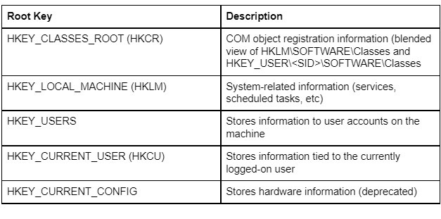
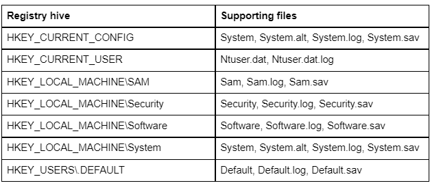
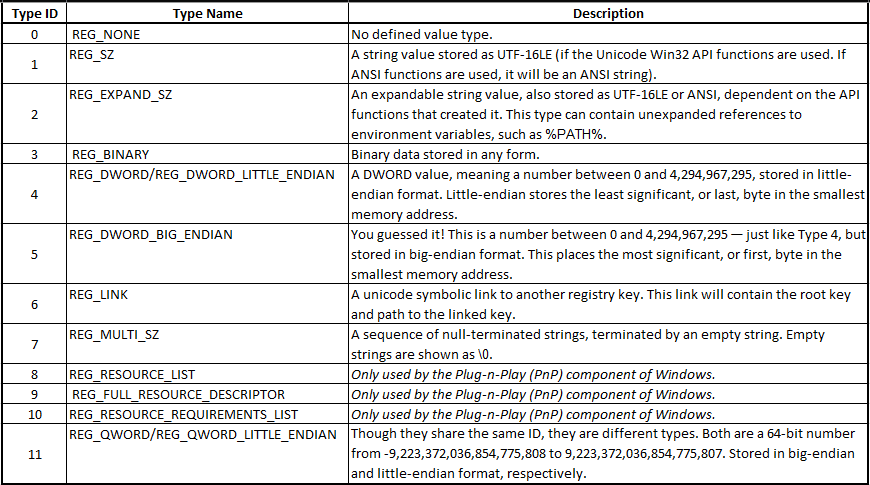
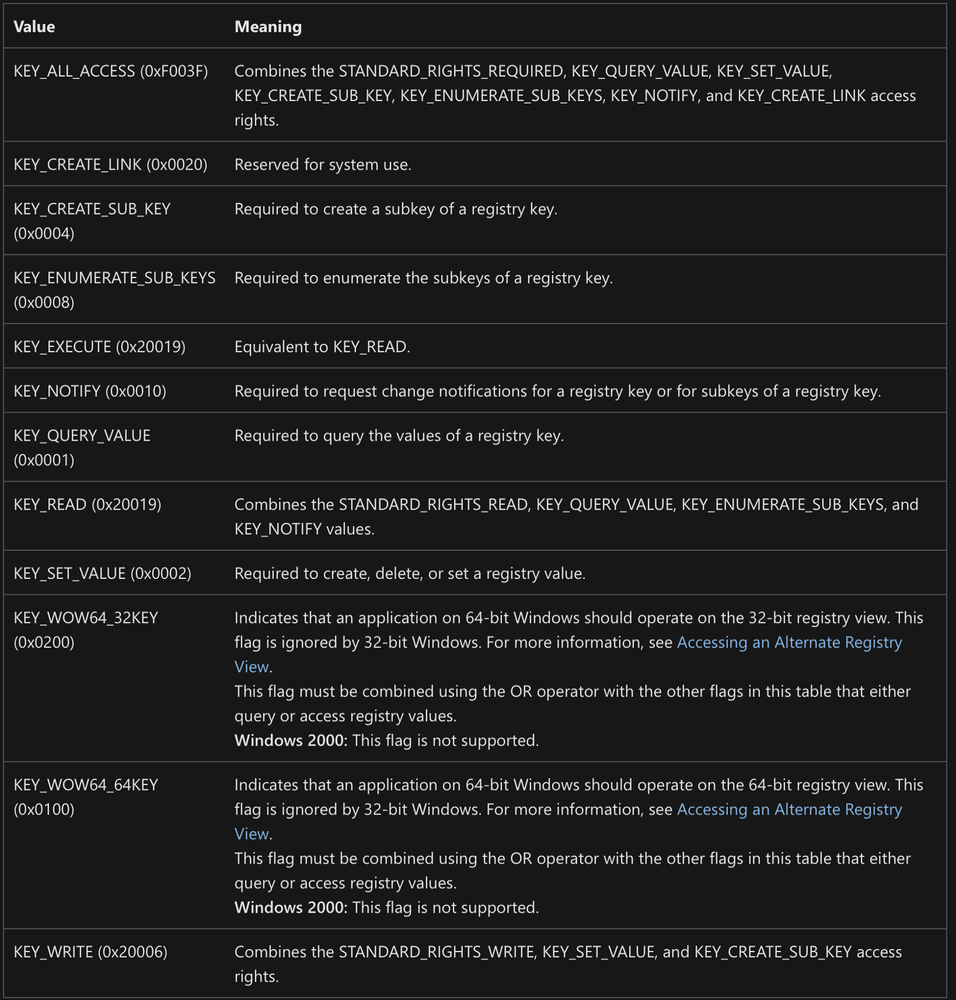
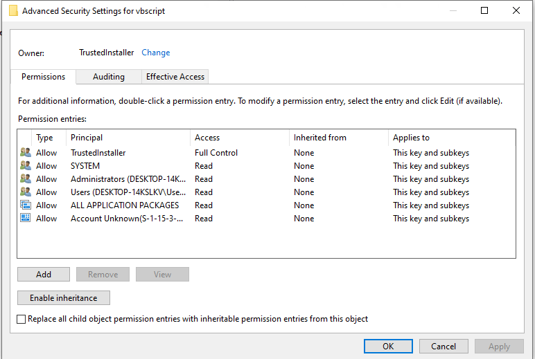
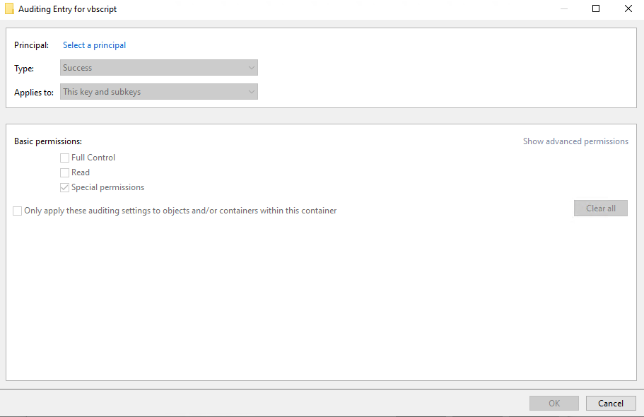
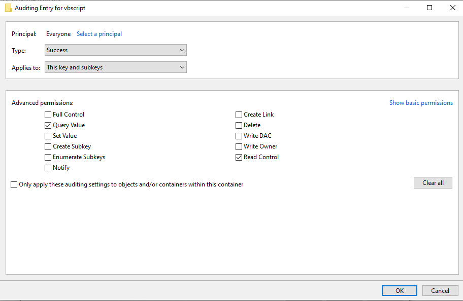
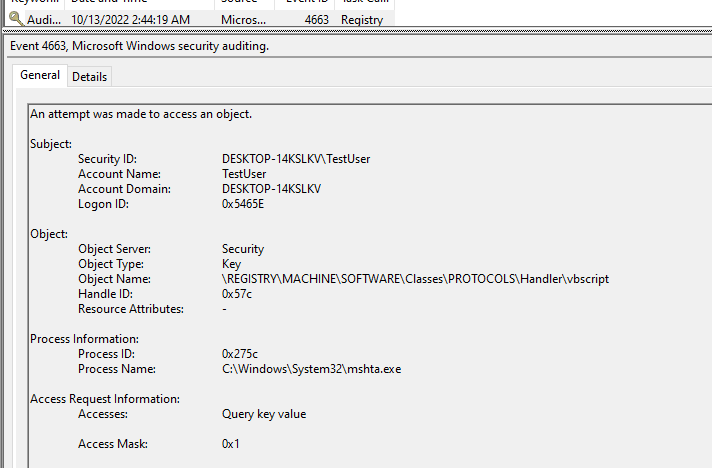

# The Defender's Guide to the Windows Registry
It's dangerous to defend the registry alone! Take this!


Authors: Luke Paine & Jonathan Johnson

## Introduction
Welcome to the Defender's Guide. This is a series of blog posts designed to give you a ground-up start to defending a specific technology from potential attackers. While a lot of this information may be redundant to a more seasoned information security personnel, even the best of us rely on Google and blog posts to get information. These posts are designed to be a one-stop shop, bringing a lot of that information together.

While each guide will be a blog post, they will also be accompanied with a folder in our Github repository with the takeaway information in a standardized, ingestible format. These will be updated each time the next guide is released. The blog post will exist in the repo in living form, in case edits need to be made to the content. 

The guides will not be limited to technology-related topics, Defender's Guides to Detection Engineering and other process-style topics are on the horizon.

## Underlying Technology
### Registry Overview
The registry is a database on Windows systems that plays a major part in the configuration and control of the system. The registry, described by [Microsoft](https://learn.microsoft.com/en-us/troubleshoot/windows-server/performance/windows-registry-advanced-users), is: 
> A central hierarchical database used in Windows 98, Windows CE, Windows NT, and Windows 2000 used to store information that is necessary to configure the system for one or more users, applications, and hardware devices.
The Registry contains information that Windows continually references during operation, such as profiles for each user, the applications installed on the computer and the types of documents that each can create, property sheet settings for folders and application icons, what hardware exists on the system, and the ports that are being used.
### Registry Usage
The Windows registry is one of the most interacted with parts of the operating system. The registry is used by almost every installed application on a system to store and manage user configurations. Many applications store user preference information in the registry in order to persist across updates, as well as query information from the registry in order to complete the task the application is designed to do.

The large amount of information stored in the registry makes it a noisy source of telemetry if you don't know where to look. Any given system has tens of thousands of reads and writes to the registry in a standard work day. It can be difficult for defenders to know where to start, which makes it a perfect target for attackers.

The top reason that attackers turn to the database is persistence. There are many ways that the registry can be used by an attacker to maintain their foothold in a network. The registry has several places where you can simply write a path to a binary, and the system will start that binary on boot. You can also hide entire executables in the registry so that you don't need to write them to disk, reconstituting them when needed to execute on the system.

For other tactics, such as Credential Access, the registry holds some importance as well. LSASS stores its list of Security Packages in the registry, which can be edited to add a new package with the ability to access LSASS.
These are just a few examples of why the registry is a gold mine for an attacker in your network.

### Registry Internals
It's easy to think of the registry as one big file that is sitting on disk. This is not the case, however. The registry is split between many files on disk that get loaded by the configuration manager, the subsystem that is in charge of implementing the registry. The configuration manager is in charge of the editing and organization of the registry, hence why the kernel level registry calls have the CM prefix (ie - CmCreateKey, CmDeleteKey). The configuration manager will load files on disk, called hives, that are in charge of various settings. However; before going into those we need to understand the registry structure.

As previously mentioned, the registry is a hierarchical database that has a tree format structure. Meaning there that each node within this tree is considered a key and in turn can have subkeys and entries called values. At the very top of this database are the root keys that can be thought of as the main directories for the subkeys embedded within them. There are 5 main root keys:



Windows also has a concept of predefined keys, which act as a simple way for registry related functions to refer to a given root key. This concept makes traversing the registry much easier as it provides a reliable starting point to locate the sub-key(s) you wish to query, create, or modify. 

Underneath these root keys are [registry hives](https://learn.microsoft.com/en-us/windows/win32/sysinfo/registry-hives), which are a group of keys/values in the registry that has an associated file that the configuration manager will load and link with the root keys. Hives can be found within the registry at ```HKEY_LOCAL_MACHINE\SYSTEM\CurrentControlSet\Control\hivelist```

The following table is provided by [Microsoft](https://learn.microsoft.com/en-us/windows/win32/sysinfo/registry-hives) as the standard hives and their supporting files:



Note: If you are wanting to dive deeper into Registry Internals/Configuration Manager we recommend reading the Windows Internals Part 2 book, specifically Chapter 10.

### Registry Key Values
There are a set number of potential registry value types for a key. Each one is associated with a type ID and type name. The below table outlines the Type ID and Type Name values that can appear in the registry (with a little flavor added):



## Registry Size Limits

**Registry Key Name:** 255 characters, including the absolute path of the key in question. This starts unabbreviated (HKEY_LOCAL_MACHINE instead of HKLM for example).
**Registry Value Name:** 16,383 Unicode characters (most Windows versions), 260 ANSI characters or 16,383 Unicode characters (Windows 2000)
**Registry Value:** Available system memory (some security telemetry products choose not to include registry key values due to the extreme size capacity)
**Registry Tree:** 512 key levels. Up to 32 levels can be created per API call.

### Registry Interaction
There are a variety of native ways to interact with the registry, but the following are the most common:

- Graphical Registry Editors
  - RegEdit.exe
- Command Line Registry Editors
  - PowerShell
  - CMD.exe
  - reg.exe
- .REG File Interaction
- Group Policy
- Windows Management Instrumentation
  - [StdRegProv Class](https://learn.microsoft.com/en-us/previous-versions/windows/desktop/regprov/stdregprov?redirectedfrom=MSDN)
- Windows API Interaction
  - [RegCreateKey*](https://learn.microsoft.com/en-us/windows/win32/api/winreg/nf-winreg-regcreatekeyw)
  - [RegSetValue*](https://learn.microsoft.com/en-us/windows/win32/api/winreg/nf-winreg-regsetvaluew)
  - [RegEnumValue*](https://learn.microsoft.com/en-us/windows/win32/api/winreg/nf-winreg-regenumvaluew)
  - [RegQueryValue*](https://learn.microsoft.com/en-us/windows/win32/api/winreg/nf-winreg-regqueryvaluew)
  - [RegConnectRegistry*](https://learn.microsoft.com/en-us/windows/win32/api/winreg/nf-winreg-regconnectregistryw)
  - [etc…](https://learn.microsoft.com/en-us/windows/win32/sysinfo/registry-functions)

It is worth noting that users may interact with the registry remotely through the RemoteRegistry service. This service is off by default, but may be turned on by administrators. This service runs on top of the [Windows Remote Registry Protocol](https://learn.microsoft.com/en-us/openspecs/windows_protocols/ms-rrp/0fa3191d-bb79-490a-81bd-54c2601b7a78). More information from a defensive perspective can be found on the [MSRPC-to-ATTACK](https://github.com/jsecurity101/MSRPC-to-ATTACK/blob/main/documents/MS-RRP.md) by Jonathan Johnson.

*[MalAPI](https://malapi.io) provides a reference of Windows API functions and correlates them to different known attacks. This is a useful resource for determining how registry interaction APIs are abused by attackers.* 

## Registry Security

All registry keys are securable objects, meaning they have a security descriptor which can be used to configure access control and auditing conditions for sub-keys and their values. Within security descriptors are two access control lists (ACLs):

- The [Discretionary Access Control List (DACL)](https://learn.microsoft.com/en-us/windows/win32/secauthz/access-control-lists) - in charge of allowing/denying access
- [The System Access Control List (SACL)](https://learn.microsoft.com/en-us/windows/win32/secauthz/access-control-lists) - which for the most part is used for auditing when attempts of access are made to the target object.

Within each ACL are access control entries (ACEs) that specify the access rights allowed, denied, or audited for a given user, group, etc.

The object-specific registry rights are defined by [Microsoft](https://learn.microsoft.com/en-us/windows/win32/sysinfo/registry-key-security-and-access-rights) as:



### SACLs

SACLs yield a lot of value for defenders because they provide additional insight into object operations in a granular way not provided by other tooling. There are multiple Window Security Events that are exposed once a SACL is set and triggered, which we will talk about in the **Relevant Telemetry** section. However; let's look into how to set a SACL for a registry object.

In this example, we are going to look at the `HKEY_CLASSES_ROOT\PROTOCOLS\Handler\vbscript` key, which is one of the registry keys we suggest setting a SACL on in our list below.

If we open regedit.exe and navigate to the `HKEY_CLASSES_ROOT\PROTOCOLS\Handler\vbscript` key, we can right-click and click on "Permissions", then hit "Advanced".



This gives us the page above. Next we want to hit "Auditing", then hit "Add". This will give us the *Auditing Entry* page below.

 

Next, click on "Select a principal" and input "Everyone", then press "Show Advanced Permissions". For this example, we are going to check "Query".

*The purpose of this action is to audit when any user performs a query registry operation on this particular key. For more information on the access rights involved, reference the table earlier in the post.*

 

After applying these settings, we open up cmd.exe and run the following mshta command:

```mshta vbscript:(CreateObject("Wscript.Shell")).Run("powershell",1,True)(window.close)```

Navigating to the Windows Event Log and viewing [event 4663](https://learn.microsoft.com/en-us/windows/security/threat-protection/auditing/event-4663) (4663 events are only generated after enabling [Audit Object Access](https://learn.microsoft.com/en-us/windows/security/threat-protection/auditing/basic-audit-object-access)) within the Security Log, you can see an event that was triggered once the command queried that registry value:

 

In situations where certain object operations are not logged, SACLs can be used to provide that additional insight.

*Note: A scriptable version of the SACL set can be found in the [Set-AuditRule.ps1](https://github.com/OTRF/Set-AuditRule/blob/master/Set-AuditRule.ps1) PowerShell script by Roberto Rodriguez. Just update the script to have the correct registry keys you want to set SACLs for.*

## Relevant Telemetry
This section will focus on native telemetry along with EDR telemetry that is exposed to us for use. Native telemetry will include Window Security Events (WSE) and EDR will include Microsoft Defender for Endpoint/Sysmon events.

### Window Security Events:
- Event ID 4657 - A Registry Value was Modified
  - Only generates if a SACL is set in the registry key for "Set Value"
- Event ID 4663 - An attempt was made to access an object
  - An example of this event can be seen in the section above

### Microsoft Defender For Endpoint:
- **DeviceRegistryEvents:** RegistryKeyDeleted
- **DeviceRegistryEvents:** RegistryKeyCreated
- **DeviceRegistryEvents:** RegistryValueDeleted
- **DeviceRegistryEvents:** RegistryValueSet

*FalconForce has publicly documented ways to leverage registry events within MDE in their [FalconFriday](https://github.com/FalconForceTeam/FalconFriday/tree/master/Persistence) repository.*

*EDRs can opt into registry telemetry by leveraging the CmReigsterCallback function. This provides roughly 60 registry operations that can be captured.*

### Sysmon:
- **Event ID 12** - Registry Create / Delete
- **Event ID 13** - Registry Value Set
- **Event ID 14** - Registry Key/Value Rename

*An explanation can be found [here](https://posts.specterops.io/utilizing-rpc-telemetry-7af9ea08a1d5), and an example Jupyter Notebook using this telemetry can be found [here](https://gist.github.com/jsecurity101/b61daa2b7f2d8a7aeec187a74ea83ab1).*

## Telemetry Notes

CurrentControlSet is a subkey within the HKLM root key that is targeted by malware (the registry keys regarding services are nested under CurrentControlSet for example) - when viewing some telemetry sources you may see ControlSet001 or ControlSet002 show up. This is because CurrentControlSet doesn't actually exist - it's a symbolic link to either ControlSet001 or ControlSet002, whichever the system is using at the time. The other is kept as a backup for the "load last known good configuration" boot option within Windows.

## Top Attack Vectors
Below is a sample of registry keys/values that we have found to be highly targeted by adversaries. With this list we have provided the registry operation we have seen performed on these keys or values. We have run all of the malware samples that we have access to in a sandbox environment and have validated that these registry keys are being used in the wild. This list will grow as our knowledge increases and the community provides feedback. 

REPO LINK:

The telemetry volume of the registry keys we have provided will change depending on your environment. Keys likeRun `Keys/Services` might be nosier than others like `HKLM\SYSTEM\CurrentControlSet\Control\Lsa\Security Packages`. We suggest doing appropriate testing in your organization before applying defensive capabilities. These suggestions are not designed to give you 100% defensive coverage or any other sweeping metric - they are simply, from our experience, the quickest wins you can get in the registry when starting from a very minimal defensive posture.

## External Resources
- Books
  - [Windows Internals Part 2 Chapter 10](https://www.amazon.com/Windows-Internals-Part-2-7th/dp/0135462401/ref=sr_1_1?crid=DVX4QQQKH4M7&keywords=windows+internals+part+2&qid=1666578591&qu=eyJxc2MiOiIxLjA5IiwicXNhIjoiMC43NSIsInFzcCI6IjEuMDgifQ%3D%3D&sprefix=windows+internals+part+%2Caps%2C101&sr=8-1)
- General Microsoft Registry Documentation
  - Microsoft Documentation on the Registry
  - https://learn.microsoft.com/en-us/troubleshoot/windows-server/performance/windows-registry-advanced-users
  - https://learn.microsoft.com/en-us/windows/win32/sysinfo/registry-value-types
  - https://learn.microsoft.com/en-us/previous-versions/windows/desktop/regprov/stdregprov?redirectedfrom=MSDN
  - https://learn.microsoft.com/en-us/windows/win32/sysinfo/predefined-keys
  - https://learn.microsoft.com/en-us/windows/win32/sysinfo/registry-hives
  - https://learn.microsoft.com/en-us/windows/win32/sysinfo/handles-and-objects
- Microsoft Win32 API Documentation
  - https://learn.microsoft.com/en-us/windows/win32/api/winreg/nf-winreg-regcreatekeyw
  - https://learn.microsoft.com/en-us/windows/win32/api/winreg/nf-winreg-regsetvaluew
  - https://learn.microsoft.com/en-us/windows/win32/api/winreg/nf-winreg-regenumvaluew
  - https://learn.microsoft.com/en-us/windows/win32/api/winreg/nf-winreg-regqueryvaluew
  - https://learn.microsoft.com/en-us/windows/win32/api/winreg/nf-winreg-regconnectregistryw
- Microsoft Securable Object Documentation
  - https://learn.microsoft.com/en-us/windows/win32/secauthz/access-control-lists
  - https://learn.microsoft.com/en-us/windows/win32/secauthz/access-control-lists
- Microsoft Registry Security Documentation
  - https://learn.microsoft.com/en-us/windows/win32/sysinfo/registry-key-security-and-access-rights
  - Microsoft RPC Documentation
  - https://learn.microsoft.com/en-us/openspecs/windows_protocols/ms-rrp/0fa3191d-bb79-490a-81bd-54c2601b7a78
- Blogposts
  - https://enigma0x3.net/2016/05/25/userland-persistence-with-scheduled-tasks-and-com-handler-hijacking/
  - https://posts.specterops.io/utilizing-rpc-telemetry-7af9ea08a1d5
- Projects
  - [MSRPC-to-ATTACK](https://github.com/jsecurity101/MSRPC-to-ATTACK/blob/main/documents/MS-RRP.md)
  - [OTRF](https://github.com/OTRF/Set-AuditRule/blob/master/Set-AuditRule.ps1)
  - [FalconFriday](https://github.com/FalconForceTeam/FalconFriday/tree/master/Persistence)
  - [Remote_Service_Creation.ipynb](https://gist.github.com/jsecurity101/b61daa2b7f2d8a7aeec187a74ea83ab1)
  - [MalAPI](https://malapi.io)
