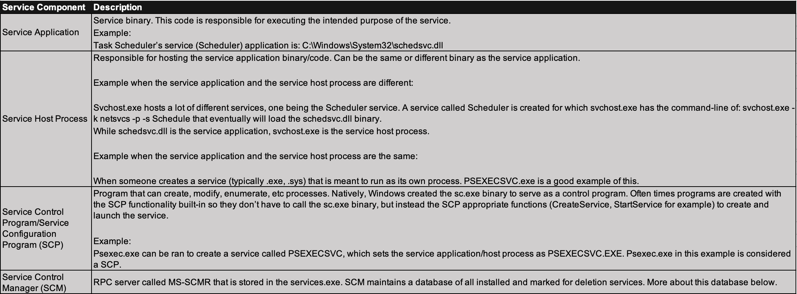
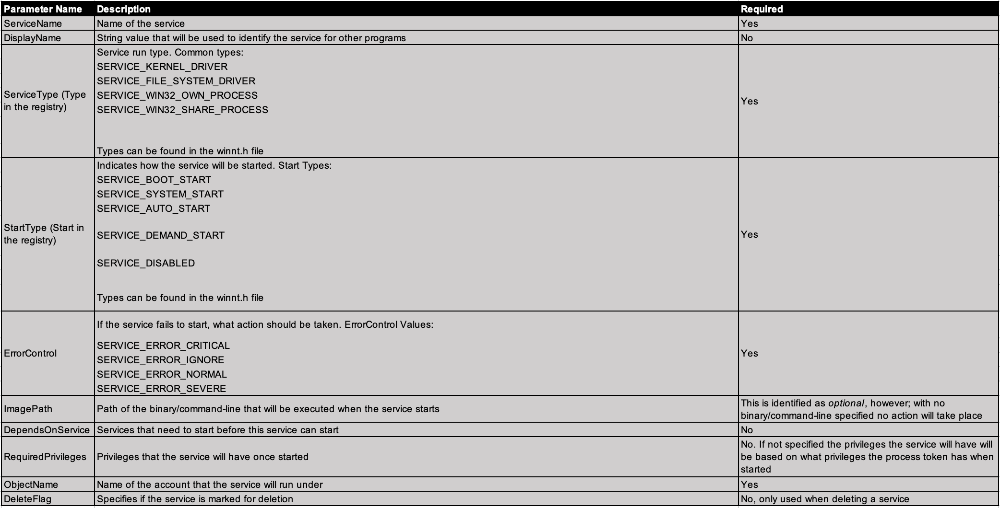
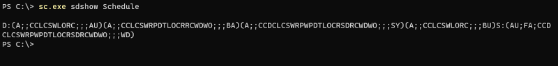
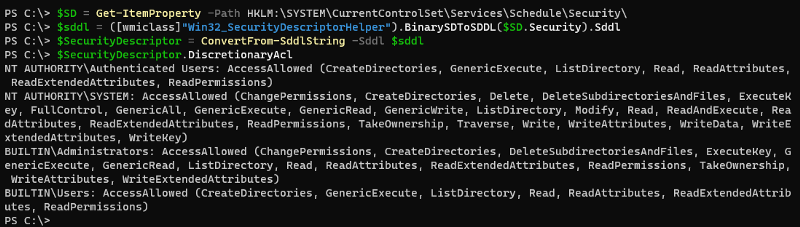
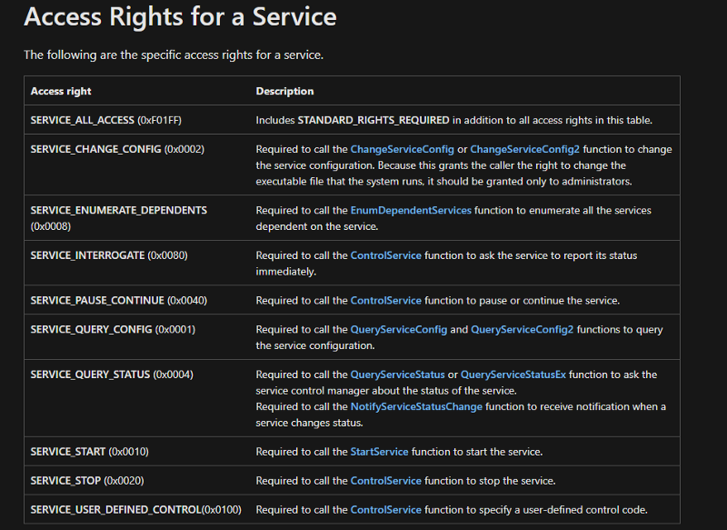
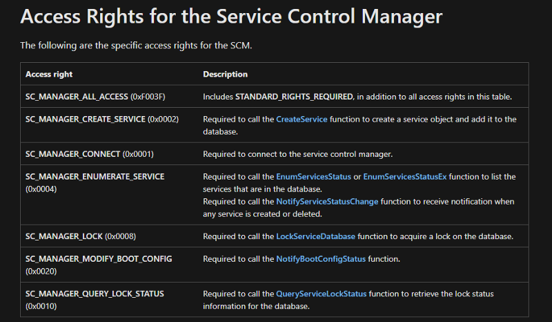
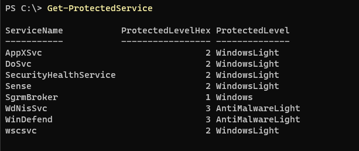

# The Defender's Guide to Windows Services
It's dangerous to find malicious services alone! Take this!


Authors: Luke Paine & Jonathan Johnson

## Introduction
This is the second installment of the Defender's Guide series. In keeping with the theme, we are discussing Windows Services, the underlying technology, common attack vectors, and methods of securing/monitoring them. Services are an important part of the Windows operating system, allowing the control and configuration of long-running processes essential to keeping the OS functional. This also allows services to be a common vector of escalation and persistence by attackers. Some services (especially custom services) run with high privilege levels, and are set to restart themselves on boot. This is a slam dunk for the enterprising attacker looking to gain a foothold in an environment.

## Underlying Technology
### Services Overview
Services, at a base level, are processes. However some significant differences exist between a service and a standard process. You can't take a standard binary and install it as a service, expecting it to work. Services must be installed before they can be executed, and they require specific functions in order for the control mechanism to interact with them, which we will go into further detail about later in this post.

#### [According to Microsoft](https://learn.microsoft.com/en-us/dotnet/framework/windows-services/introduction-to-windows-service-applications):

*"Microsoft Windows services, formerly known as NT services, enable you to create long-running executable applications that run in their own Windows sessions. These services can be automatically started when the computer boots, can be paused and restarted, and do not show any user interface. These features make services ideal for use on a server or whenever you need long-running functionality that does not interfere with other users who are working on the same computer. You can also run services in the security context of a specific user account that is different from the logged-on user or the default computer account"*

### Services Usage
The average user doesn't have to interact with the services console, and even power users might rarely find themselves taking a look through the installed services. A lot of them are essential to the functionality of Windows itself, and a lot of them are installed with software over the lifecycle of the machine.
Although services can be manually controlled, the interactions with them are essentially limited to Start and Stop. Any GUI elements spawned by a service are displayed in a separate window station from the interactive one of the current user. Think of this as a hidden desktop dedicated to each service. 
As per Microsoft:

 *"Because the station of the Windows service is not an interactive station, dialog boxes raised from within a Windows service application will not be seen and may cause your program to stop responding."*

What if you wanted to interact with those stations, or a service wanted to interact with the station you are able to see? Microsoft has an answer for that, too.

*"The .NET Framework also does not include classes that represent stations and desktops. If your Windows service must interact with other stations, you will need to access the unmanaged Windows API."*

In short, user interaction with Windows services is rather low. Why do we, and attackers, care about them so much? Read on, dear defender, read on.

### Services Internals
At a high level, services are backed by a Remote Procedure Call (RPC) server called the Service Control Manager (SCM). This server is stored within the services.exe binary and allows for creation, configuration, enumeration, and maintenance of services. Services are one of the core components of the Windows operating system (OS) and (depending on the service) is needed for the OS to successfully boot/run.
As previously mentioned, services are backed by a RPC server called the SCM ([MS-SCMR](https://learn.microsoft.com/en-us/openspecs/windows_protocols/MS-SCMR/705b624a-13de-43cc-b8a2-99573da3635f)) stored within the services.exe binary. However; when thinking about services, there are really 4 main components:



### Service Control Manager (SCM)
When the service.exe binary is started during the boot process, service.exe goes through various functions to get the SCM up and running. One of which is a function that generates the service database. It does so by scanning the contents of the Services registry key (HKLM\SYSTEM\CurrentControlSet\Services\). Each entry is added to the database and is considered a service record. Every record will have the name of the service and its correlating parameters (more information on this later).

After boot, if someone wants to register a service and launch it during that same boot lifecycle, they must use the appropriate service-based Win32 APIs or call the MS-SCMR RPC methods directly. This allows communication to be sent to the SCM through RPC, which will allow for the creation of a service by creating an entry within the Services registry key, for which after the SCM will create another service record within the service database.

Someone could manually add a key to the registry within the Services registry key, however; the SCM doesn't know how to add that as a record. To get that service to launch, a reboot is required. The SCM will then add that service into the database appropriately.

### SCM Functions
The Win32 APIs that can be used to interface with the SCM can be found in the [winsvc.h](https://learn.microsoft.com/en-us/windows/win32/api/winsvc/) or advapi32.dll/sechost.dll. When the supported Win32 APIs are called, they eventually make a call to the RPC service binary (services.exe) that will execute a MS-SCMR method.

Example: [CreateServiceW](https://learn.microsoft.com/en-us/windows/win32/api/winsvc/nf-winsvc-createservicew) will act as the RPC client that makes a NdrClientCall, that will trigger the invocation of the MS-SCMR method RCreateServiceW.

For more information on this please visit:
Utilizing RPC Telemetry
* [A Voyage to Uncovering Telemetry](https://posts.specterops.io/utilizing-rpc-telemetry-7af9ea08a1d5) 
* [Identifying RPC Telemetry for Detection Engineers](https://specterops.io/wp-content/uploads/sites/3/2022/06/RPC_for_Detection_Engineers.pdf)


### Service Parameters
When a service is created, the services characteristics are passed in as parameters. Some parameters are needed in order for the service to be successfully launched, while others are optional. A list of common parameters:



## Service Security

Services, like the registry, are objects that can have a security descriptor applied to them, making them securable objects. These rights specify which principals can control the service and perform actions like - start/stop, delete, etc. There are various ways to check a service's security descriptor. Microsoft supplies a Win32 API called QueryServiceObjectSecurity, however there are ways to do this with some built-in Windows binaries as well:

**sc.exe:**
``` 
sc.exe sdshow <ServiceName>
```



**PowerShell** (really only helpful if another folder of "Security" is held within the service's name key):
```
$SD = Get-ItemProperty -Path HKLM:\SYSTEM\CurrentControlSet\Services\Schedule\Security\
$sddl = ([wmiclass]"Win32_SecurityDescriptorHelper").BinarySDToSDDL($SD.Security).Sddl
$SecurityDescriptor = ConvertFrom-SddlString -Sddl $sddl
$SecurityDescriptor.DiscretionaryAcl
```



Because we are dealing with securable objects (again, just like the registry) there are access rights that are checked against the service's security descriptor and the principal's token. Microsoft has documented these access rights for us in [Service Security and Access Rights](https://learn.microsoft.com/en-us/windows/win32/services/service-security-and-access-rights):



The SCM actually has its own access rights as well. These are built out so that when someone tries to create, delete, or modify a service they have to connect with the SCM. Microsoft has documented these as well:



Lastly, within this section we want to briefly mention a special "kind" of service - protected services. These are very common with EDR vendors. Alex Ionescu has a great blog post series called [The Evolution of Protected Processes](https://www.crowdstrike.com/blog/evolution-protected-processes-part-1-pass-hash-mitigations-windows-81/). Not to get into specifics, but if a service has a value in it called "LaunchedProtected" and the value is set to 0x02, 0x08, then the service binary (either .exe or .dll) is running as a protected process. Jonathan Johnson wrote a PowerShell script that can be found in his [gist](https://gist.github.com/jsecurity101/6b9e87f5a428f31d41ffc8c1ee05a999) that will enumerate all protected processes and services.



## Top Attack Vectors

### Service Creation

#### Persistence/Privilege Escalation
Often when services are discussed, persistence is in the conversation. Services have the ability to be started at boot/system start. This is nice for attackers to keep a foothold of a highly privileged account for persistence and being that services are created so often it can be hard for analysts to identify malicious services vs. non-malicious services.

#### Execution/Lateral Movement
Service creation can also be used for execution or lateral movement. A common example that is brought up would be PsExec, which is known to create a service and execute it on a remote system.

Creating a detection for these tactics requires telemetry for new service installations on the system, which is possible but potentially noisy.

### Service Modification
Services can be easily abused for privilege escalation in a number of ways:

#### Unquoted Service Path with Space
If a service path is unquoted and contains a space, similar to DLL search order hijacking, the system will look for "C:\Program Files\Company.exe" before it tries "C:\Program Files\Company Name\test.exe", allowing for a simple drop-in of a binary without any modification of the service itself.

#### User-Writable Service Path
If the path that the service binary resides in is user writable, the service binary can simply be replaced in order to gain execution. The new binary will be executed with the same privilege level as the original binary.

#### User-Modifiable Service
If a service is able to be modified by a user, the service path can be changed to point to a new binary. This includes registry modifications to service data (though a restart would be required for the changes to take effect).

## Tips To Identifying Malicious Services

It can be fairly difficult to classify a malicious service. This is because the telemetry you will see below can be somewhat limited in the data they expose. It isn't enough to look at a service name, image path, etc to identify if a service was malicious. So, we wanted to give you all some potential things to look for that might help. 
* Check to see how prevalent that service is within your organization. A good example of this is PsExec. PsExec is a very common service that gets dropped by adversaries. However; if your organization doesn't allow administrators to use PsExec for remote administration tasks (which we don't suggest allowing) then seeing a PsExec service (PsExecSvc)created is very alarming.
* Non-readable service names. C2's allow for the attacker to control what the service name is, however it isn't uncommon for attackers to just leverage defaults when running those commands. Those defaults often include names that are unreadable and could just be a string of characters. The DFIR Report from 2021 shows an example of this when a service was installed with the string 27b435 . 
* Uncommon Image paths. A lot of attackers drop files in the C$, ADMIN$ shares, as well as in Temp directories. If you see services installed with a path from one of these directories, we suggest looking into it. 
* Service installation has a network connection. We often look for services that were installed where the request came over the network network and/or if the service itself has network connections after startup. This could give us context as to where the creation instruction came from and/or where the communication is going out to. 

There are obviously a lot of other things to look for when looking at services - like looking for the service binaries VT score, but we wanted to give a few things we typically like to look at. The telemetry below are ways to identify newly created services and modified services.

## Service Telemetry
This section will focus on native telemetry along with EDR telemetry that is exposed to us for use. Native telemetry will include Window Security Events (WSE) and EDR will include Microsoft Defender for Endpoint/Sysmon events.

### Window Security Events:
- Event ID 4697 (Security) - A service was installed in the system
    - Dependent on RPC call - RCreateService* being called. For more information please visit: TelemetrySource.
- Event ID 7045 (System) - A service was installed in the system
    - Dependent on RPC call - RCreateService* being called.

### Microsoft Defender For Endpoint:
* DeviceEvents:ServiceInstalled
- Dependent on RPC call - RCreateService* being called.
* DeviceRegistryEvents:RegistryKeyCreated
- DeviceRegistryEvents:RegistryValueSet


### Sysmon:
* Event ID 12 - Registry Create / Delete
*  Event ID 13 - Registry Value Set

*An explanation can be found [here](https://posts.specterops.io/utilizing-rpc-telemetry-7af9ea08a1d5), and an example Jupyter Notebook using this telemetry can be found [here](https://gist.github.com/jsecurity101/b61daa2b7f2d8a7aeec187a74ea83ab1).*

## Telemetry Notes

As seen above, many of the events are dependent on the RPC call RCreateService* being called. As previously mentioned, a service can be created by adding a registry key and not using any of the supported SCM APIs. That being known, looking for registry key creations/set values within the services registry key (HKLM:\SYSTEM\CurrentControlSet\Services) is a more robust solution than relying on service creation times. This will trigger a lot of alerts if solely looking for key creations within services registry key, so we suggest performing proper post-alert processing to properly identify potentially malicious services that were created.


## External Resources
* Windows Internals Book Part 2, Chapter 10
* [Service Control Manager](https://learn.microsoft.com/en-us/windows/win32/services/service-control-manager)
* [Utilizing RPC Telemetry](https://posts.specterops.io/utilizing-rpc-telemetry-7af9ea08a1d5)
* [Winsvc.h](https://learn.microsoft.com/en-us/windows/win32/api/winsvc/)
* [CreateServiceW](https://learn.microsoft.com/en-us/windows/win32/api/winsvc/nf-winsvc-createservicew)
* [TelemetrySource](https://github.com/jsecurity101/TelemetrySource/tree/main/Microsoft-Windows-Security-Auditing)
* [Introduction to Windows Services](https://learn.microsoft.com/en-us/dotnet/framework/windows-services/introduction-to-windows-service-applications)
* [QueryServiceObjectSecurity](https://learn.microsoft.com/en-us/windows/desktop/api/winsvc/nf-winsvc-queryserviceobjectsecurity)
* [ProtectionChecks.ps1](https://gist.github.com/jsecurity101/6b9e87f5a428f31d41ffc8c1ee05a999)
* [The Evolution of Protected Processes](https://www.crowdstrike.com/blog/evolution-protected-processes-part-1-pass-hash-mitigations-windows-81/)
 
